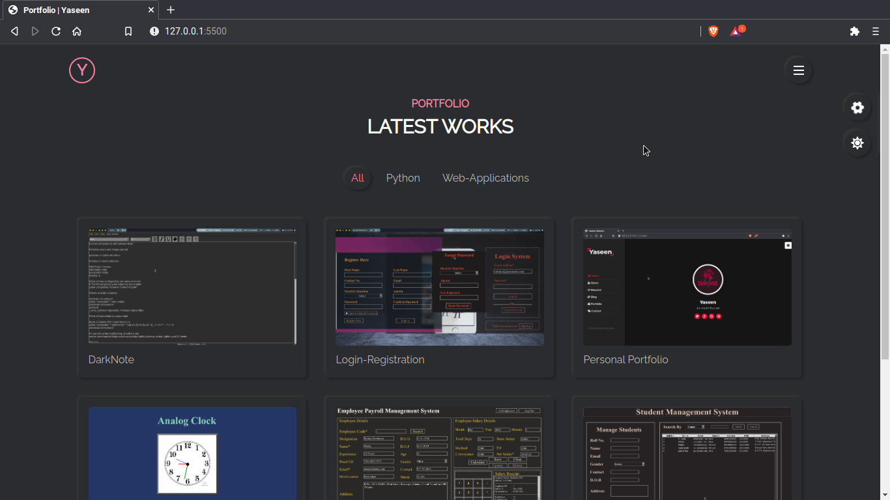
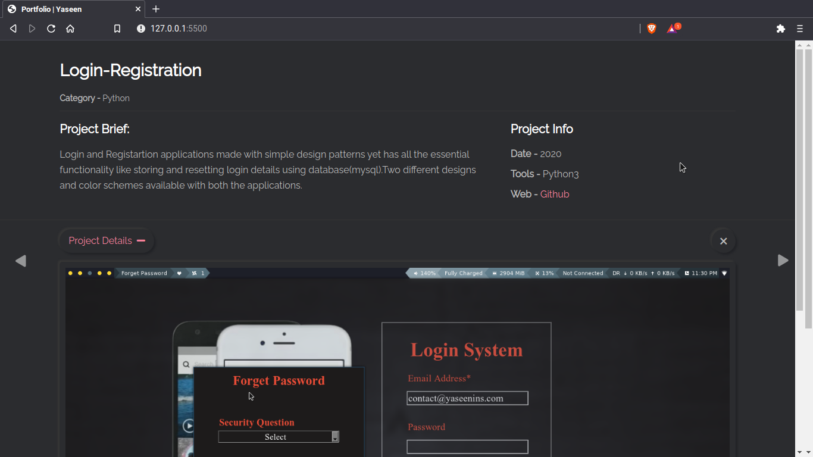

Personal-Portfolio

 This is fully responsive Personal Portfolio Website Template which features Neomorphism Design.

Description
============

This personal portfolio is simple,modern,creative,responsive based on Neomorphism Design.It’s suitable  for any agencies, Web  Designer & Developer ,Graphic Designer, Photographer and freelancers which need a professional way to showcase their projects and services with 100% super responsive experience..Everything in the code is well commented and W3 Validated.Working contact form was made available whose dynamic features were handled by AWS services like Lambda,API Gateway and SES.

Features
=========
• Responsive Layout 
• 5 Color Skins 
• Light/Dark 
• Smoooth transitions 
• Live Style Switcher 
• Clean Code 
• W3C Validated 
• HTML5 & CSS3 & JAVASCRIPT 
• Cross Browser Compatible 
• 100% Customizable, all colors can be customized 
• Project Image Format 
• Font Awesome Icons 
• Well-commented code 
• Google Fonts 
• Working Contact From using AWS services 

Usage
======

• Copy the code and modify to your liking 
• Most importantly modify the contact.js with your API gateway url to work with your domain as my url wont work with Yours 
• Host your Static Site either in services like Github pages,Gitlab pages or in AWS S3 bucket,AWS amplify
